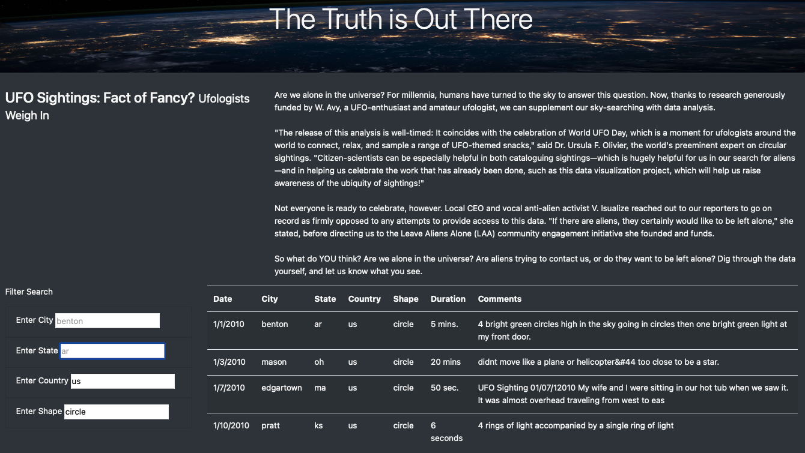

# UFOs

## Overview of the Project
The purpose of this analysis is to create a filterable table to display the UFO data. By combining the files of
java_script, css, and html file, we are creating a webpage to filter through thousands of UFO events gathered from a java_script list. By opening the website through the .html file, we can filter by date, city, state, country, or shape in order
to better search for data we want.

## Result

The whole dataset includes features of Date, city, state, country, shape, duration, and comments.
And my project allows users to search by city, state, country and shape to search for specific data
information. As you can see above, by specifying the country with us shape with circle, we can filter
the whole dataset to be only four rows left.

## Summary
The key for this project is to combine the .js, .css and .html files together in order to finish the work.
one drawback of this new design is the input format needs to be specified, so the users need to input data with
strict format which may cause inconvenient. I think this deign can be improved by fixing the filter input format in
order to accept most formats of input. Moreover, the font of the table that contains the data should be bolder and lighter will
be much better.
